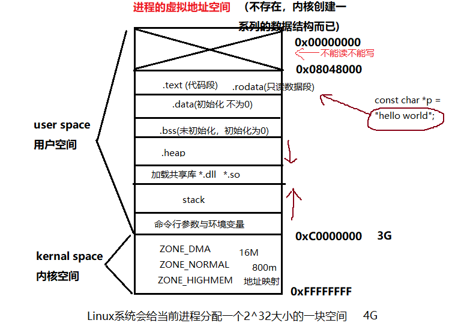

文本段(Text Segment)：存放程序的代码，又称为代码段。

初始化数据段(Data Segment)：存放程序中初始化的全局变量和静态变量。

未初始化数据段(BSS Segment)：存放程序中未初始化的全局变量和静态变量。

堆(Heap)：用于动态内存分配，如C++中的new和delete，C中的malloc和free。

栈(Stack)：用于存放函数调用栈，局部变量，函数参数等。

