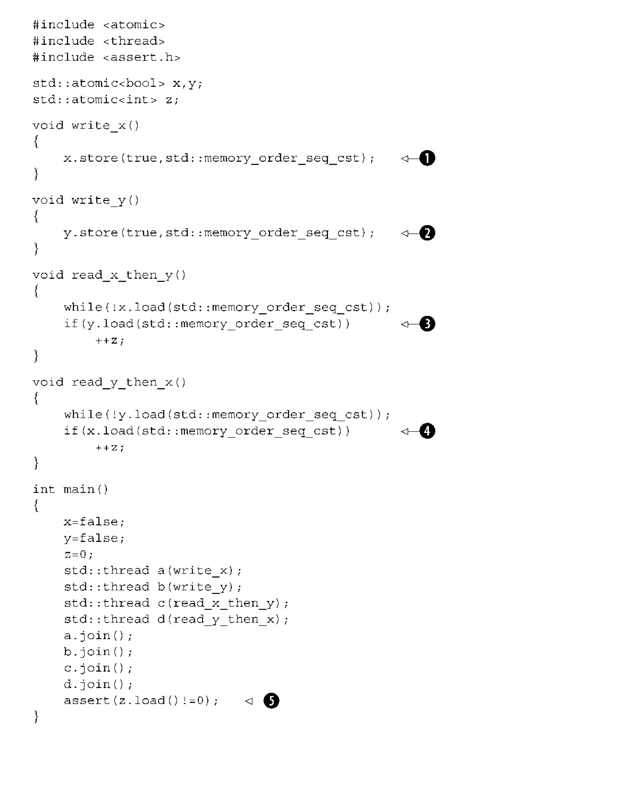
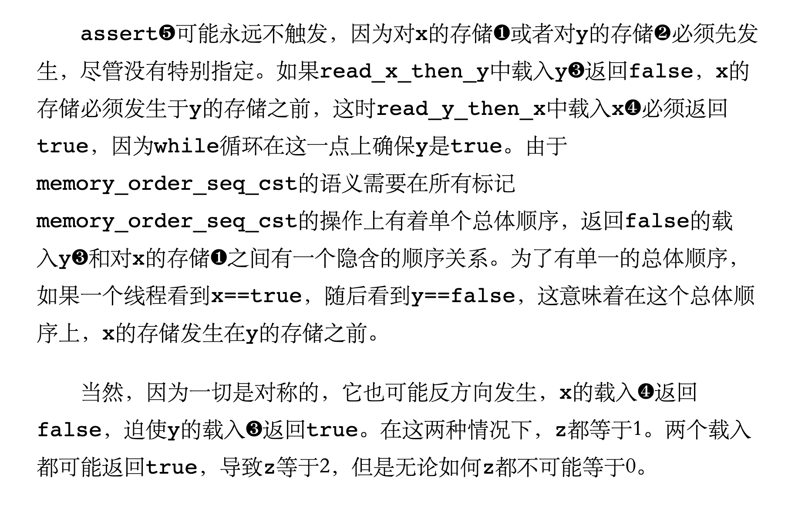
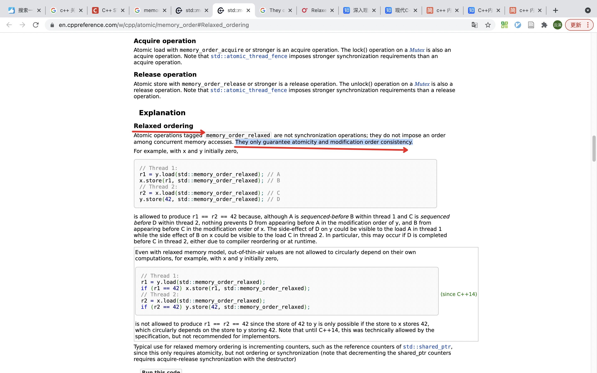
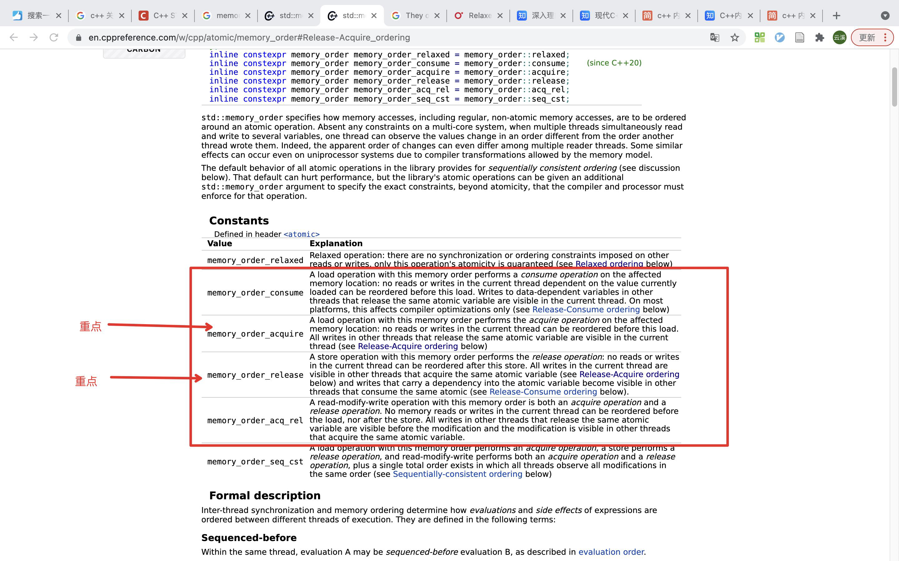
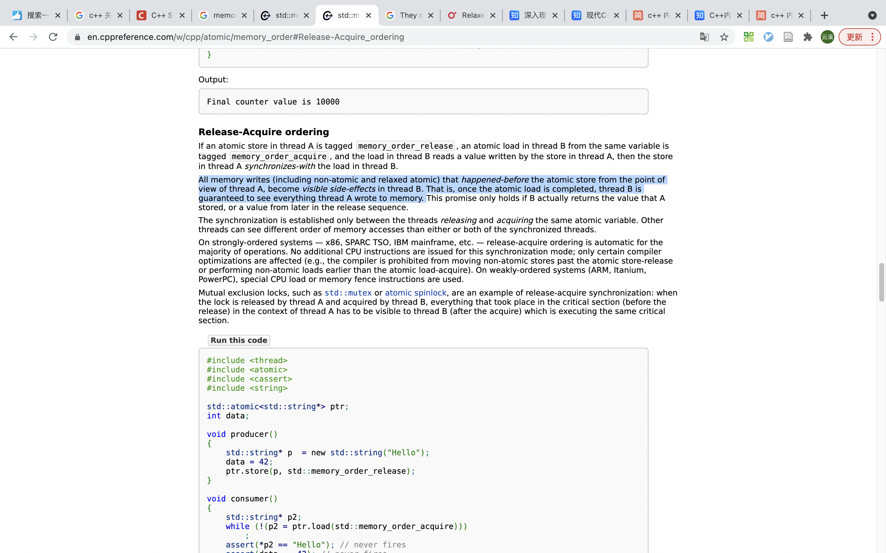
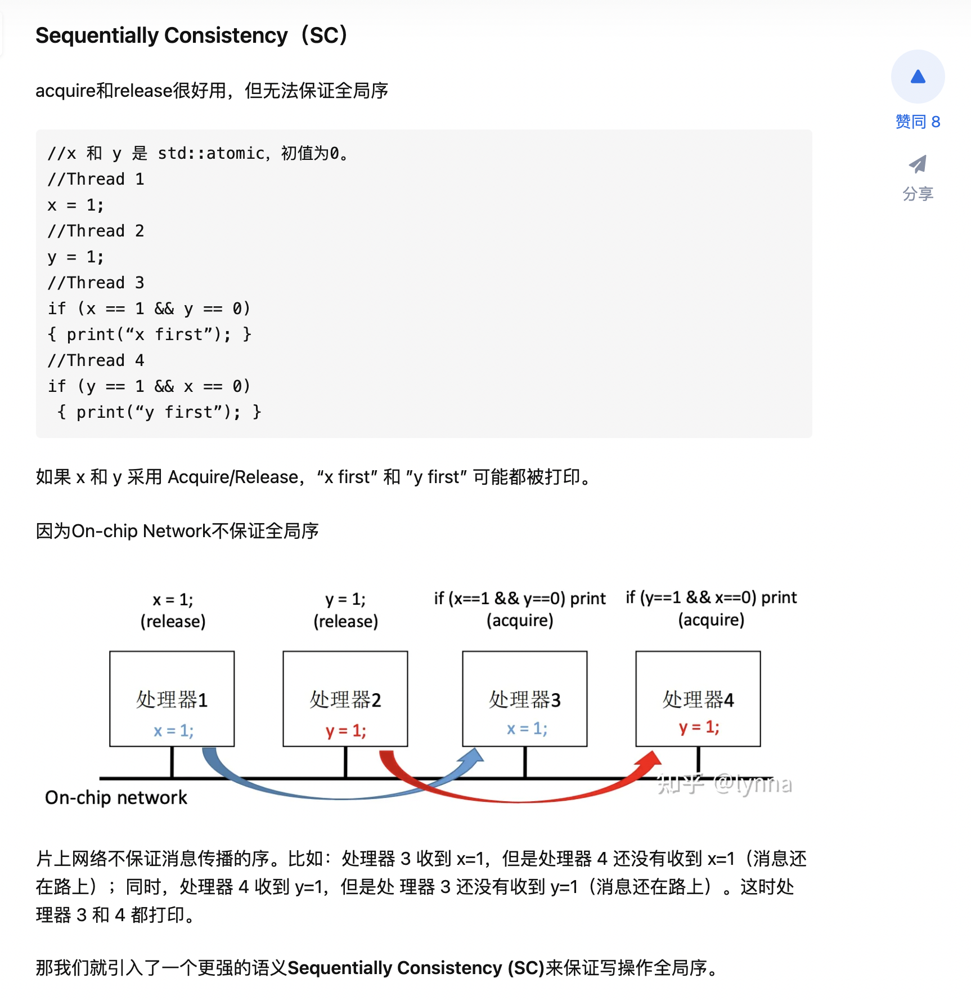

原子变量功能三特点：a.操作原子性 b.有序性 c.可见性

多线程程序观察到乱序执行的4个原因:(详见链接1)
1. 编译器优化
2. cpu优化
3. cpu的cache
4. on-chip network

原子变量相关实现方式，见链接1

1. 顺序一致的内存顺序(默认方式)
SC > acquire/release(除了ac/re外，还保证多个原子变量的写操作全局有序，详见链接1)

std::memory_order_seq_cst

2. 松散的内存顺序
std::memory_order_relaxed

Typical use for relaxed memory ordering is incrementing counters, such as the reference counters of std::shared_ptr, since this only requires atomicity, but not ordering or synchronization (note that decrementing the shared_ptr counters requires acquire-release synchronization with the destructor)

`#include <vector>
#include <iostream>
#include <thread>
#include <atomic>
 
std::atomic<int> cnt = {0};
 
void f()
{
    for (int n = 0; n < 1000; ++n) {
        cnt.fetch_add(1, std::memory_order_relaxed);
    }
}
 
int main()
{
    std::vector<std::thread> v;
    for (int n = 0; n < 10; ++n) {
        v.emplace_back(f);
    }
    for (auto& t : v) {
        t.join();
    }
    std::cout << "Final counter value is " << cnt << '\n';
}
`

3. 获取-释放的内存顺序
std::memory_order_consume
std::memory_order_acquire
std::memory_order_release
std::memory_order_acq_rel

原子载入是获取（aquire）操作（memory_order_acquire），原子存储是释放（release）操作（memory_order_release），原子的读修改写操作（例如fetch_add()或exchange()）是获取、释放或两者兼备（memory_order_acq_rel）

他不保证多个原子变量的写是全局有序(核心是处理器分发消息,详见链接1)

1. 高质链接：https://zhuanlan.zhihu.com/p/508169761(百度内部培训的ppt，质量非常高)
