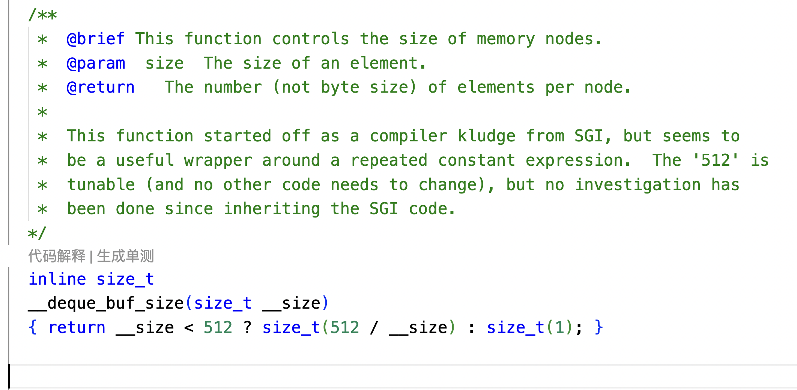
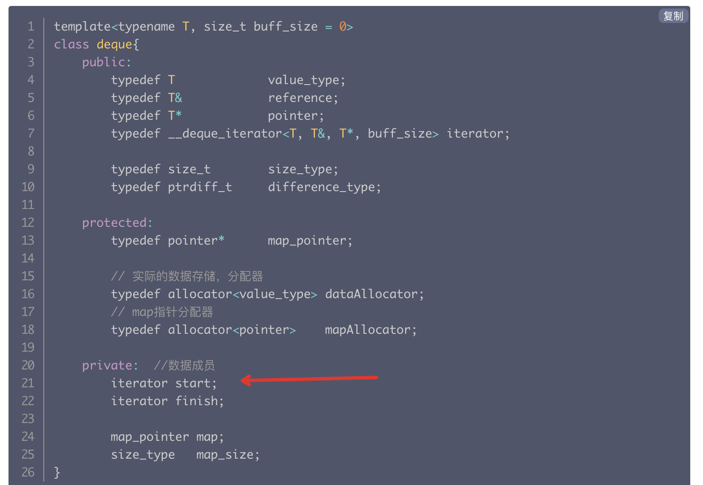
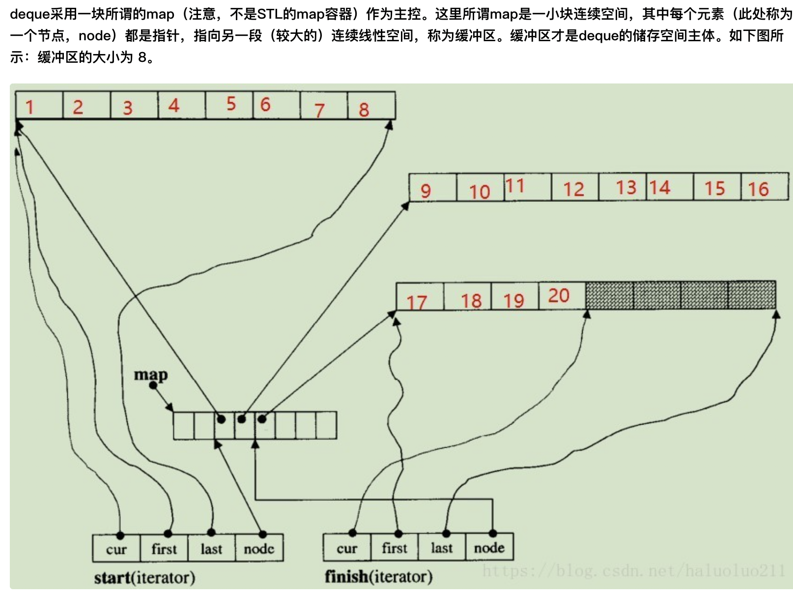

1. deque上一个block有多少个元素？ --和元素大小有关，也就是说元素类型就决定了一个block上的元素个数

2. deque的核心成员

3. deque迭代器的核心成员

4. deque实现的图示

5.为什么STL的 stack 默认使用deque而不是vector作为底层容器
原因在于：随着容器的元素增加，对于vector而言可能涉及到申请新的空间，复制原有的元素到新的空间，释放原有的旧空间。而deque则没有这个问题
见： https://stackoverflow.com/questions/102459/why-does-stdstack-use-stddeque-by-default?rq=1

6. deque与vector性能对比
随机访问都是O(1),但是deque因为是用索引数组实现，所以要解两次引用。
deque收尾元素的增删都是O(1), 但是vector首元素的增删是O(n)
随着容器的元素增加，对于vector而言可能涉及到申请新的空间，复制原有的元素到新的空间，释放原有的旧空间。而deque则没有这个问题。

