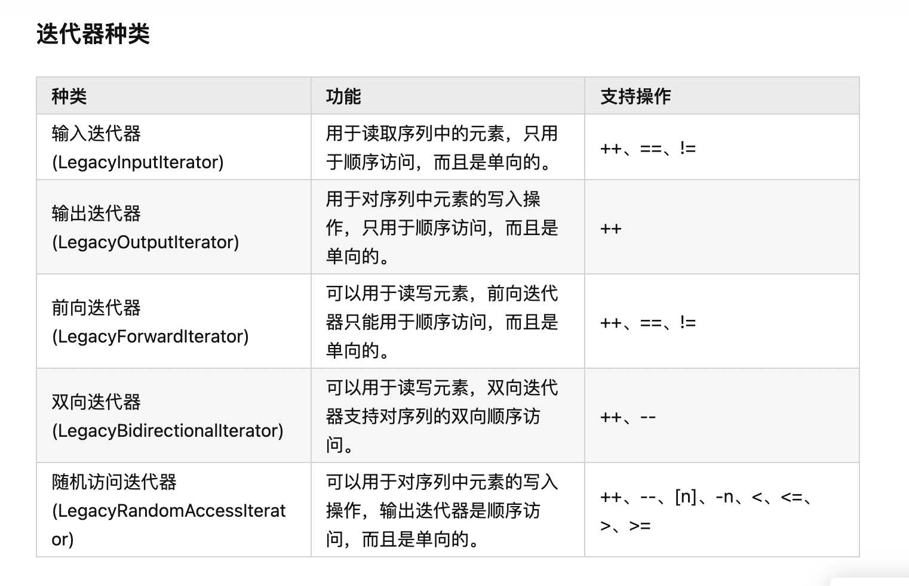

* 前向迭代器:
    forward_list
    unordered_set（无序集合）
    unordered_multiset（无序多重集合）
    unordered_map（无序映射）
    unordered_multimap（无序多重映射）

* 双向迭代器: 
    list（双向链表）
    forward_list（单向链表）
    set（集合）
    multiset（多重集合）
    map（映射）
    multimap（多重映射）

* 随机访问迭代器:
    vector（向量）
    deque（双端队列）
    array（数组）
    string（字符串）