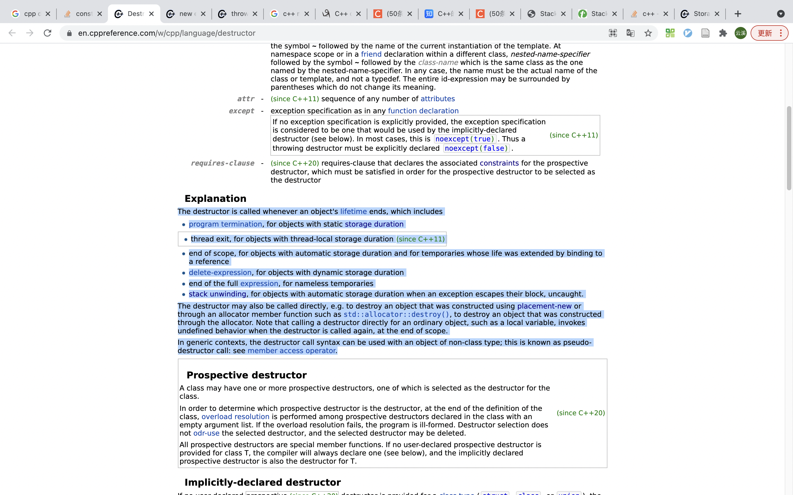
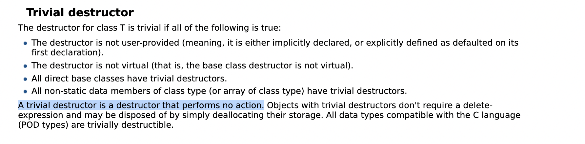

# 默认构造函数
默认构造函数的行为

满足下列条件的即平凡的构造函数, 不做任何事

# 默认拷贝构造函数
### 执行分支
* trival

* untrival
  * union类型
  * class or struct类型

值的说明的是：
a. 成员变量是定义好数量的数组的话，是深拷贝
b. 对成员变量进行拷贝时，忽略访问权限的限制

# 默认析构函数
* A destructor is a special member function that is called when the lifetime of an object ends. The purpose of the destructor is to free the resources that the object may have acquired during its lifetime.

### 析构函数调用时机

### 析构函数的执行顺序

### 平凡析构函数

# 默认重载赋值运算符函数
与拷贝构造函数类似。见链接，不表。

# 默认重载取址运算符函数
见链接，不表

# 默认重载取址运算符const函数
见链接，不表

# 默认移动构造函数（C++11）

# 默认重载移动赋值操作符函数（C++11）

附:
1. https://blog.csdn.net/fpcc/article/details/122996351(c++ 中的trivial类型)
2. https://en.cppreference.com/w/cpp/language/default_constructor(默认构造函数官方文档)
3. https://zhuanlan.zhihu.com/p/29734547(eligible似乎是c++20的新概念)
4. https://www.runoob.com/cplusplus/cpp-data-types.html(c++的内置类型就是我们常说的基本类型)
5. https://www.zhihu.com/question/50587650(c++默认构造函数不对内置类型进行初始化？同意陈硕的回答)
6. https://en.cppreference.com/w/cpp/language/storage_duration(c++将storage duration进行了分类，并逐一说明)
7. https://www.ibm.com/docs/en/zos/2.2.0?topic=only-stack-unwinding-c(讲解了什么是stack unwinding)
8. https://en.cppreference.com/w/cpp/language/destructor(析构函数说明的官方文档，讲解了析构函数执行的时机, 默认析构函数会执行什么动作)
9. 唯一需要我们手动调用析构函数的情况(placement new)
   a. 这里有说什么是placement new : https://en.cppreference.com/w/cpp/language/new#Placement_new
   b. 这里有说delete操作一共是哪两个步骤：https://www.cnblogs.com/zhxmdefj/p/12292669.html
   c. 结合a&b我们可以知道为什么placement new为什么需要手动调用析构函数而不是执行delete操作
10. https://juejin.cn/post/7023663680671711245(C++：取地址及const取地址操作符重载)
11. https://en.cppreference.com/w/cpp/language/copy_constructor ( 拷贝构造函数官方文档 )
12. https://en.cppreference.com/w/cpp/language/copy_assignment( 重载赋值运算符官方文档 )

